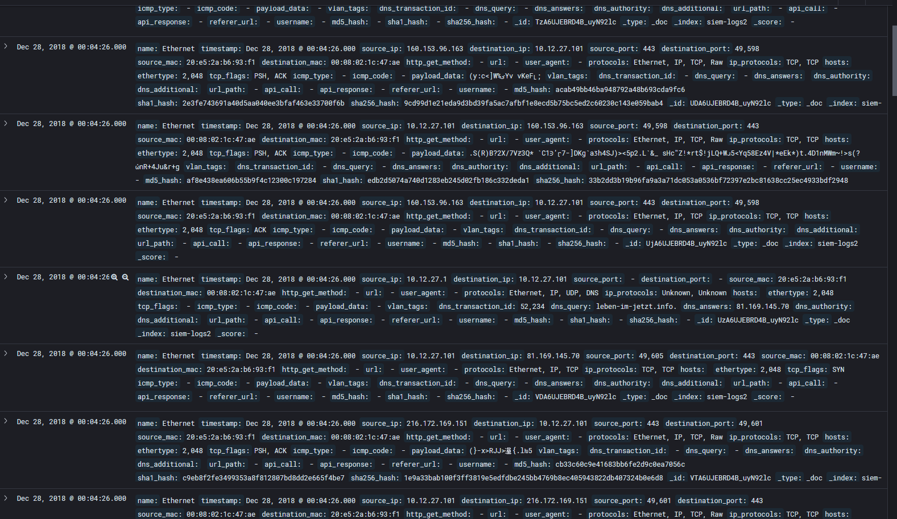

# Siem-Logs
Category: Forensics

Difficulty: Medium


```
DESCRIPTION

We need your investigation skills on the siem2* Kibana index. The attack occured in 2018, it is reccommended to set your timeline prior to this year.
```


In this challenge we are given a Elastic instance
.png)


Next step, search for logs. 
From the "Visualize and Explore Data" category, select "Discover"

Then, change the time window to include the year 2018 as instructed.
.png)
..make sure to change the index pattern to "siem-logs2*"

2.png)


..and we get the logs.

```
Question 1
Provide the malicious IP
```

At first I wasn't able to find the malicious IP but question 2 gave a clue.

```
Question 2
Considering that the attackers also targeted students, provide the malicious domain used in the attack. (Flag format: domain only eg: google, facecbook)
```

Since there are less domains than IP addresses I found on the filter `referer_url` the most used value was `studentvisaconsultantsdelhi.com`

.png)

Given the name of the domain, this should be the answer.

If we use the `referer_url` filter with the above domain we get only 2 logs
.png)

So, if these requests were the malicious ones, the `destination_ip` should be the answer to question 1

```
Question 3
Which web content management solution was exploited during he attack?
```

With the filter `url` we get to see the most used ones. 

.png)

Apparently there are very few and both of them indicate that the content management software was `Wordpress`


## Answers
```
Question 1
Provide the malicious IP
Answer: 103.53.43.239
```

```
Question 2
Considering that the attackers also targeted students, provide the malicious domain used in the attack. (Flag format: domain only eg: google, facecbook)
Answer: studentvisaconsultantsdelhi
```

```
Question 3
Which web content management solution was exploited during he attack?
Answer: wordpress
```