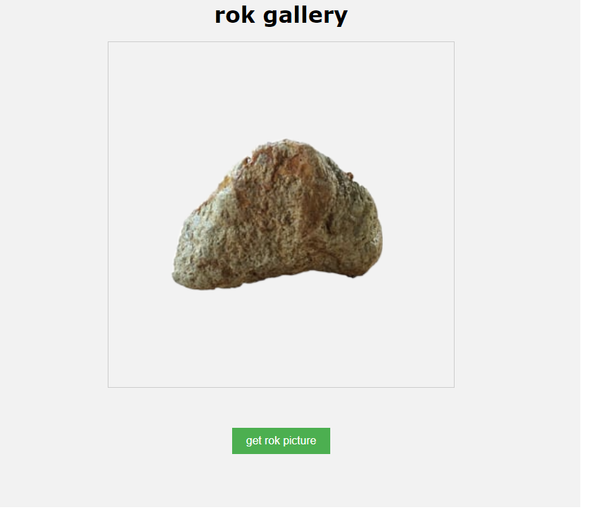
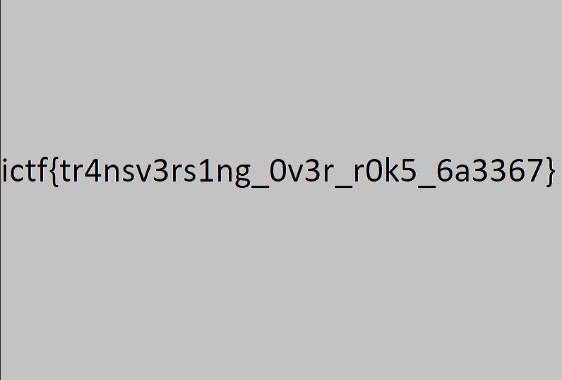

# roks (web)

>My rock enthusiast friend made a website to show off some of his pictures. Could you do something with it?

http://roks.chal.imaginaryctf.org/

# Solution
In this challenge we are given a website that shows a different image of a rock when the button is pressed.



 As seen in the source code there are 10 images and they are shown randomly.

```<!DOCTYPE html>
<html>
<head>
    <title>rok gallery</title> </style>
    <link rel="stylesheet" type="text/css" href="styles.css"> 
</head>
<body>
    <h1>rok gallery</h1>
    
    <br><br>
    <button onclick="requestRandomImage()">get rok picture</button>
    <script>
        function requestRandomImage() {
	    var imageList = ["image1", "image2", "image3", "image4", "image5", "image6", "image7", "image8", "image9", "image10"]

            var randomIndex = Math.floor(Math.random() * imageList.length);
            var randomImageName = imageList[randomIndex];

            var xhr = new XMLHttpRequest();
            xhr.onreadystatechange = function () {
                if (xhr.readyState === 4 && xhr.status === 200) {
                    var blob = xhr.response;
                    var imageUrl = URL.createObjectURL(blob);
                    document.getElementById("randomImage").src = imageUrl;
                }
            };

            xhr.open("GET", "file.php?file=" + randomImageName, true);
            xhr.responseType = "blob";
            xhr.send();
        }
    </script>
</body>
</html>
```
_index.php_


We notice that when the button is pressed a GET request is made to `http://roks.chal.imaginaryctf.org/
http://roks.chal.imaginaryctf.org/file.php?file=imageN`. 

So let's see `file.php`

```
<?php
  $filename = urldecode($_GET["file"]);
  if (str_contains($filename, "/") or str_contains($filename, ".")) {
    $contentType = mime_content_type("stopHacking.png");
    header("Content-type: $contentType");
    readfile("stopHacking.png");
  } else {
    $filePath = "images/" . urldecode($filename);
    $contentType = mime_content_type($filePath);
    header("Content-type: $contentType");
    readfile($filePath);
  }
?>
```
The `$filename` has the value of the GET parameter `file` supplied by the URL (and possibly by the user). Very interesting!

However it's urldecoded to eliminate any encoded characters in the URL (such as `%20`). Also notice that the following if statement checks if any of the characters `/` or  `.` exists in the filename. This prevents a directory traversal attack.

Digging into php's documentation about the [urldecode()](https://www.php.net/manual/en/function.urldecode.php) we get this warning

_```The superglobals $_GET and $_REQUEST are already decoded. Using urldecode() on an element in $_GET or $_REQUEST could have unexpected and dangerous results.```_

In other words, the value of the `file` is decoded two times. This means that if for example the url has the string 

`Hello%20World`

 the first decoding will result in 
 
 `Hello World` 
 
 and the second decoding will give the same result. 
 
 However if the original string is 
 
 `Hello%2520World` (encoded two times)
 
 the  first decoding becomes 
 
 `Hello%20World` 
 
 and the second becomes `Hello World`.


Meanwhile our goal is to bypass the first condition (perform a directory traversal attack) and load the flag file instead of an image. So, all we need is to write the dir traversal payload and url encode it 3 times; it's decoded 2 times just before it reaches the if condition and a 3rd time inside the else. This way, the `$filename` at the if condition would not contain any `/` or `.` characters and the `$filepath` would have the original payload.

Moreover, the Dockerfile has an info about the flag

`COPY flag.png /`

So, the payload is `../../../../flag.png`

The final url will look like this
http://roks.chal.imaginaryctf.org/file.php?file=%25252E%25252E%25252F%25252E%25252E%25252F%25252E%25252E%25252F%25252E%25252E%25252F%25252Fflag%25252Epng

and we get the flag


